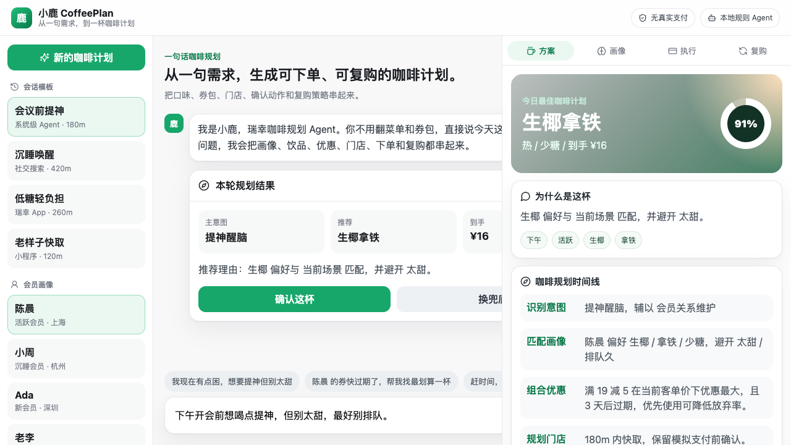

<div align="center">

# 小鹿 CoffeePlan

**从一句需求，到一杯可下单、可复购的咖啡计划**

2026 AI 先锋未来人才大赛 · 瑞幸咖啡命题参赛 Demo

[](https://github.com/logcjj/luckin-loop-agent)
[](https://logcjj.github.io/luckin-loop-agent/)

Vite · React · TypeScript · 本地规则 Agent · 无需任何 Key 即可运行

</div>

---

## 一句话定位

**小鹿 CoffeePlan** 是面向瑞幸会员运营的咖啡规划 Agent：用户只说“我现在需要什么”，系统就结合会员画像、口味偏好、券包、门店距离和复购节奏，生成一杯可解释、可确认、可回写的咖啡方案。

它的重点不是再做一个点单聊天框，而是把 AI 入口里的用户意图转成瑞幸可运营的会员关系资产。

## 为什么需要它

用户可能从系统助手、搜索、社交对话或其他 Agent 发起消费需求，而不是先打开品牌 App。瑞幸已有高频数字化交易和 Lucky AI 点单能力，下一步机会不是再做一个“能下单的客服”，而是把外部入口里的模糊意图沉淀为可解释、可运营、可复购的会员关系资产。

咖啡决策很碎：时间、天气、门店距离、券、口味、健康偏好、排队风险都会影响转化。小鹿把这些变量合成一个清晰的推荐动作，并解释为什么推荐、为什么用这张券、后续怎么复购。

## Demo 做了什么

打开页面后，可以完成一条完整链路：

1. 选择会员和真实场景：会议前提神、沉睡唤醒、低糖轻负担、老样子快取。
2. 在对话区输入一句自然语言需求。
3. Agent 输出咖啡规划：主意图、推荐饮品、到手价、稳妥度。
4. 右侧方案画布展开画像、优惠解释、执行链路和复购闭环。
5. 点击“确认这杯”进入模拟留位。
6. 点击“模拟支付完成”进入复购运营页，指标回写。



## 核心创新

| # | 创新点 | 说明 |
|---|---|---|
| 1 | 一句话咖啡规划 | 从“菜单推荐”升级为“目标规划”，用户只说需求，Agent 串起画像、券、门店和复购。 |
| 2 | 会员记忆驱动推荐 | 使用合成会员画像模拟偏好、避忌、价格敏感度、券包、复购周期和信任风险。 |
| 3 | 可解释优惠与信任保护 | 推荐必须解释原因、优惠券选择和隐私边界，降低“被诱导/价格不透明”的感知风险。 |
| 4 | 下单前权限门 | Demo 只做模拟订单；真实写操作必须二次确认，体现 Agent “提议，人拍板”。 |
| 5 | 复购闭环 | 接受、放弃、支付等反馈回写到运营指标和复购话术，而不是一次性转化。 |

## 架构

```text
前端三栏工作台
  左侧：会话模板 / 会员画像
  中间：咖啡规划对话 / 快捷 prompt / 本轮结果
  右侧：方案 / 画像 / 执行 / 复购画布

本地 Agent 决策层
  Intent Graph：识别提神、低糖、快取、优惠尝新等意图
  Member Memory：会员偏好、避忌、券包、复购周期、信任风险
  Next Best Action：饮品、优惠、门店、话术、复购计划
  Trust Guard：推荐解释、优惠解释、隐私和支付边界

合成数据层
  4 个会员样本
  4 个场景模板
  本地规则引擎，无真实 API、无真实支付、无真实个人数据
```

## 快速开始

```bash
npm install
npm run dev
```

本地访问：

```text
http://localhost:5173/
```

GitHub Pages 地址：

```text
https://logcjj.github.io/luckin-loop-agent/
```

生产构建：

```bash
npm run build
```

## 目录结构

```text
luckin-agent-submission/
├── README.md
├── docs/
│   ├── submission-copy.md      # 报名表可直接粘贴文案
│   ├── solution-brief.md       # 开题补充材料
│   ├── demo-design.md          # Demo 设计说明
│   ├── demo-walkthrough.md     # 演示脚本
│   └── screenshots/
├── research/
│   └── research-notes.md       # 研究笔记和来源
├── src/
│   ├── data/demoData.ts        # 合成会员与场景数据
│   ├── logic/agent.ts          # 本地 Agent 决策
│   └── main.tsx                # Demo UI
└── goal/goal-1/                # Goal 工作流记录
```

## 密钥与隐私

- 不需要 OpenAI、MiniMax、地图或瑞幸真实 API key。
- 不调用真实下单和支付接口。
- 不保存真实用户数据。
- 所有会员、订单、券包均为 synthetic demo data。

## 交付物

- 报名表文案：[`docs/submission-copy.md`](docs/submission-copy.md)
- 方案补充材料：[`docs/solution-brief.md`](docs/solution-brief.md)
- 研究笔记：[`research/research-notes.md`](research/research-notes.md)
- Demo 设计：[`docs/demo-design.md`](docs/demo-design.md)
- 演示脚本：[`docs/demo-walkthrough.md`](docs/demo-walkthrough.md)
