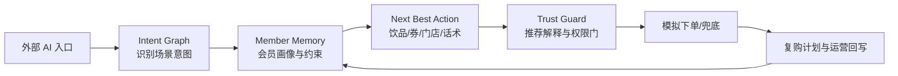

# 小鹿 CoffeePlan 方案补充材料

## 1. 命题理解

瑞幸命题的关键词不是“点单”，而是“流量运营闭环”。当用户入口迁移到系统级 Agent、社交搜索、车机、手机助手等场景后，品牌无法默认拥有页面流量，也不一定能直接展示完整营销货架。此时，更早理解用户意图、更清楚解释推荐，并把成交反馈回写成会员资产，才是重构会员关系的关键。

瑞幸已有 APP/小程序高频交易、会员分层和 Lucky AI 点单基础，因此参赛方案不应停留在“AI 帮我买咖啡”。小鹿 CoffeePlan 的定位是“咖啡规划 Agent”：用户说一句今天的状态，Agent 给出一杯可解释、可确认、可复购的咖啡方案，并把唤醒、推荐、优惠、下单、复购串成闭环。

## 2. 产品体验

Demo 采用三栏结构：

- 左侧：会话模板和会员画像，模拟不同人群包。
- 中间：对话入口，用户输入自然语言需求。
- 右侧：方案画布，展开方案、画像、执行、复购。

示例输入：

```text
下午开会前想喝点提神，但别太甜，最好别排队。
```

示例输出：

- 主意图：提神醒脑。
- 推荐：生椰拿铁，热 / 少糖。
- 优惠：满 19 减 5，到手 ¥16。
- 执行：系统级 Agent 捕捉需求，推荐饮品，选择 180m 内门店，进入模拟支付页。
- 复购：成交后 48 小时记录反馈，下次同场景优先展示快捷复购。

## 3. 核心链路



## 4. 模块说明

### Intent Graph

识别提神、低糖轻负担、快捷复购、优惠尝新等意图，并结合时间、天气、距离、入口渠道形成场景判断。

### Member Memory

记录会员状态、城市、偏好、避忌、价格敏感度、最近下单天数、券包、信任风险和近期订单。本 demo 使用合成数据，不涉及真实隐私。

### Next Best Action

输出下一最佳动作：饮品推荐、糖冰配置、优惠券组合、模拟门店距离、下单路径和触达话术。

### Trust Guard

每次推荐必须解释：

- 为什么是这杯。
- 为什么用这张券。
- 使用了哪些数据。
- 哪些动作需要用户二次确认。

### Growth Loop

将接受、放弃、支付、兜底反馈回写到指标和复购策略，用于后续人群包运营与 A/B 测试。

## 5. 可量化价值假设

试点阶段可观察：

- 推荐点击率提升 15%。
- 沉睡会员唤醒率提升 8%-11%。
- 复购周期缩短 10%。
- 券解释覆盖率达到 100%，降低因价格/券规则不清导致的放弃。

这些数值目前是方案假设，用于 demo 展示；真实落地需通过灰度实验验证。

## 6. 与常规方案差异

| 能力 | 常规推荐/客服 | 小鹿 CoffeePlan |
|---|---|---|
| 用户输入 | 搜索词或菜单点击 | 一句话场景目标 |
| 推荐依据 | 商品热度、历史购买 | 意图 + 画像 + 券 + 门店 + 信任风险 |
| 结果形态 | 饮品列表 | 可执行咖啡计划 |
| 优惠处理 | 展示券 | 解释为什么用这张券 |
| 下单安全 | 直接跳转 | 写操作二次确认 |
| 运营闭环 | 成交结束 | 成交/放弃反馈回写复购 |

## 7. 落地可行性

小鹿 CoffeePlan 不要求瑞幸推翻现有系统。它可以先作为 Agentic Commerce 的意图运营层，接入已有订单、券、门店、会员和开放 AI 能力：

1. 先用合成数据和规则引擎完成 demo 验证。
2. 小流量接入真实会员标签和券包。
3. 对推荐点击、券使用、支付转化、复购周期做 A/B 测试。
4. 将通过验证的 Agent 能力开放给系统助手、车机、社交搜索等入口。

## 8. 当前 Demo 边界

- 不接入真实瑞幸 API。
- 不发起真实订单或支付。
- 不使用真实用户数据。
- Agent 逻辑为本地规则模拟，后续可替换为 LLM + 工具调用 + 可观测链路。
