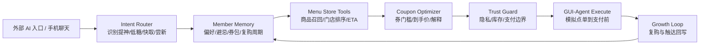

# 小鹿 CoffeePlan 方案补充材料

## 1. 命题理解

瑞幸命题的核心不是“能不能让 AI 帮我买一杯咖啡”，而是当用户入口迁移到系统级 Agent、手机助手、社交搜索、车机和浏览器后，品牌如何继续理解用户意图、建立信任并沉淀会员资产。

小鹿 CoffeePlan 的定位是“瑞幸意图增长智能体”：用户用一句自然语言表达此刻状态，系统把它转成一杯可解释、可执行、可回写的咖啡计划。它不是替代瑞幸 App，而是在外部入口和瑞幸现有交易/会员体系之间补上一层 Agentic Commerce 的意图运营层。

## 2. 产品体验

### 桌面端：FlowNav 工作台

桌面端参考小满的“三幕故事”和 HireEasy 的 FlowNav 结构，把体验拆成：

1. 今日任务：推荐商品、门店、券包、Agent 编排。
2. Agent 对话：用自然语言解释意图、记忆和执行前确认。
3. 推荐策略：候选召回、评分、券策略、兜底计划、订单路径。
4. 自动执行：手机大窗模拟点单，GUI-Agent cockpit 展示 Observation / Thought / Action / Guardrail。
5. 增长回写：唤醒话术、复购计划、体验指标。
6. 数据接入：公开来源、adapter 蓝图、真实/模拟/blocked 边界。

### 手机端：聊天起手

手机端不是桌面缩窄版，而是像小满手机视图一样先进入聊天流：

- Agent 先解释能做什么。
- 用户给出一句需求。
- 系统展示商品方案卡、官方商品图、取餐 ETA、到手价。
- 定位卡提供“用附近门店 / 拒绝定位”两条路径。
- 点击“执行点单”后进入手机点单模拟，底部弹窗显示链路进度。

## 3. 核心链路

## 4. Agent 设计

| Agent/模块 | 输入 | 输出 | 护栏 |
|---|---|---|---|
| 场景路由 Agent | 用户文本、时间、天气、入口渠道 | 主意图、辅助意图、置信度 | 低置信度时只给候选，不自动执行 |
| 会员记忆 Agent | 合成会员、券包、历史订单、授权范围 | 偏好、避忌、信任解释 | 不读取跨 App 隐私，不使用真实会员数据 |
| 菜单门店工具 Agent | 商品库、门店 mock、定位状态 | 候选商品、候选门店、履约风险 | 库存/ETA 必须标注 mock 或来源 |
| 券包收益 Agent | 券门槛、商品价格、价格敏感度 | 到手价、券解释、放弃风险 | 不承诺真实价格和真实扣券 |
| 增长回写 Agent | 接受/放弃/执行状态 | 唤醒话术、复购策略、指标 | 可退订、低打扰，不制造虚假紧迫感 |

## 5. 真实数据与 adapter

当前 demo 已使用可追溯的公开商品视觉：

- Luckin Coffee US Signature Lattes：Coconut Latte、Velvet Latte 等图片。
- Luckin Coffee US Fruity Americano：Orange Americano 等图片。
- Luckin Coffee US Single Origin Espresso：Americano、Flat White 类图片。

同时明确以下限制：

- 中国区价格、库存、券包、门店排队、会员权益均为 demo mock。
- 浏览器定位只在用户点击后触发，不保存精确坐标。
- 真实会员、券包、支付、扣券必须通过瑞幸官方授权链路。
- GUI-Agent 自动执行只在本地 UI 模拟，不调用真实 App，不创建订单。

Adapter 蓝图包括：官方菜单图片 Snapshot、定位授权与门店兜底、会员权益、下单支付、门店履约。详见 [`data-sample.md`](data-sample.md)。

## 6. 可量化价值假设

试点阶段可观察：

- 推荐接受率：目标提升 10%-15%。
- 沉睡会员唤醒：目标提升 6%-11%。
- 决策时长：减少用户在菜单、券包和门店之间切换的时间。
- 履约稳定度：通过排队、距离、库存风险参与排序降低放弃。
- 信任解释覆盖率：推荐、券、定位、支付边界 100% 可解释。

这些数值目前是 demo 假设，真实落地需要灰度实验验证。

## 7. 与常规方案差异

| 能力 | 常规推荐/客服 | 小鹿 CoffeePlan |
|---|---|---|
| 用户输入 | 搜索词、菜单点击 | 一句话场景目标 |
| 推荐依据 | 热门商品、历史购买 | 意图 + 会员记忆 + 券 + 门店 + 信任风险 |
| 结果形态 | 商品列表 | 可执行咖啡计划 |
| 手机体验 | H5 缩窄或客服窗 | 聊天起手 + 方案卡 + 执行弹窗 |
| 下单安全 | 跳转支付 | 模拟执行，支付前停止 |
| 真实边界 | 往往不说明 | 数据来源、adapter、blocked 项显式展示 |
| 运营闭环 | 成交即结束 | 接受/放弃/拒绝定位/执行状态回写 |

## 8. 当前 Demo 边界

- 不接入真实瑞幸中国区 API。
- 不发起真实订单或支付。
- 不保存真实用户数据或精确坐标。
- 商品图片引用公开官方菜单 CDN；离线时核心决策仍可运行。
- Agent 逻辑为本地规则模拟，后续可替换为 LLM + 工具调用 + 可观测链路。
